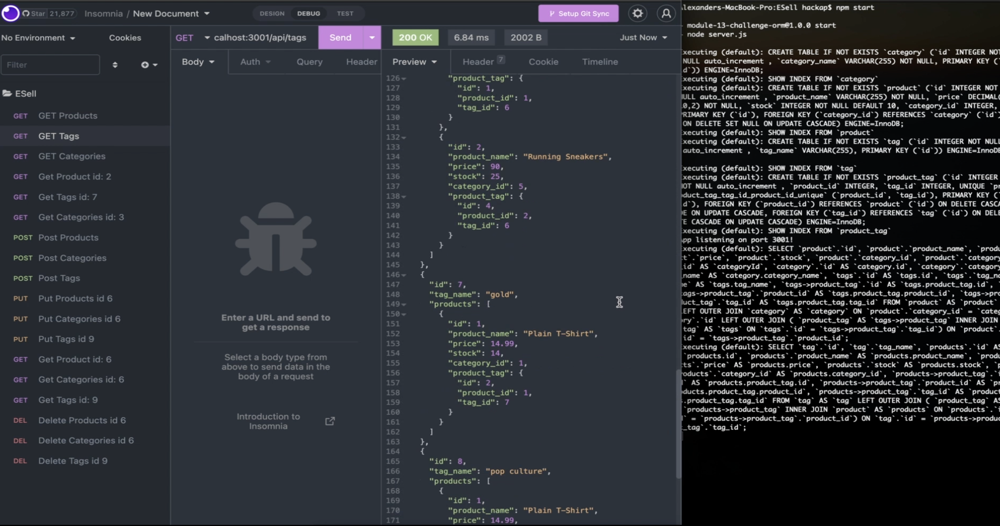

# ESell

## DEMO VIDEO

<a href="https://drive.google.com/file/d/1qdNwKDijxszrr8obxVynCqULmSVeiIat/view?usp=sharing" title="ESell Demo"><a>

## Description
ESell is a mocked up ecommerce site designed to utilize node, sequelize, mysql2, and dotenv.

    The motivation behind the ESell build was simply to get more experience working with sequelize and hiding sensitive information with the dotenv package.

    The balance and cleanliness of having seperate model files extending and matching up with api routes/seeds was really nice to work with, and has really challenged me to build my code bases as modular and clean as I can. 

 
 
 

## Table of Contents

* **[Usage](#usage)** 
* **[Contributing](#contributing)** 
* **[Contact](#contact)** 

### Usage
<a name="usage"/>
You will need to clone this repo, and navigate to the code base in your command-line. From there access mysql using "mysql -u 'your username here' -p" and then enter your password. Once in you will need to give mysql the command "source db/schema.sql" you should now exit mysql, "quit" works.  
 
Next we need to seed the database. Do this by entering "node seeds/index.js" and then simply enter "npm start". You are now running on localhost (the port should display on connect!) 
 
 
 
 
 

<a href="https://choosealicense.com/licenses/none/">none</a> 
            For more information on the coverage of this license please click on the link above.

### Contributing
<a name="contributing"/>
hackpres is the primary contributor.

### Contact
<a name="contact"/>
for questions please contact <a href="https://github.com/hackpres">hackpres</a> 

